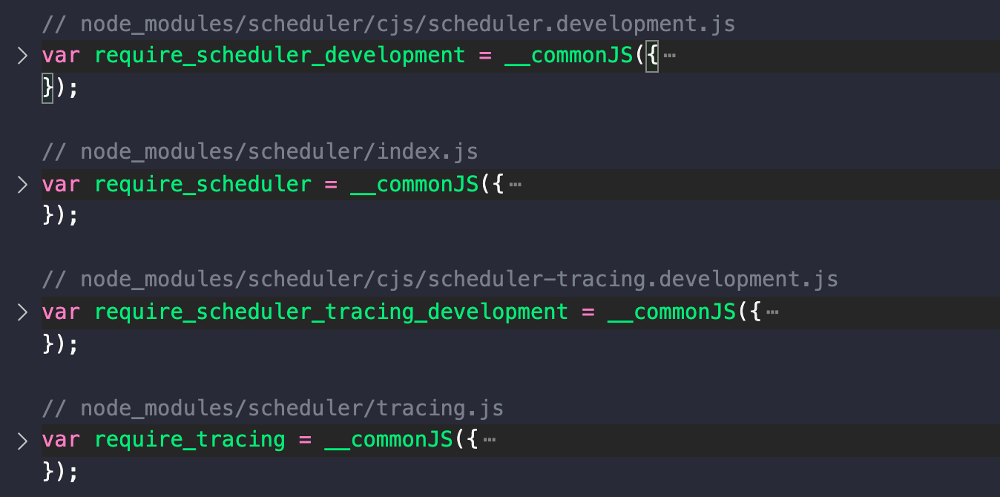

# 预构建

预构建有两个原因，这个Vite文档里也有[详细说明](https://cn.vitejs.dev/guide/dep-pre-bundling.html#the-why)。简单来说，一是因为dev阶段Vite默认所有模块都为ES模块，因此需要对CJS和UMD的模块进行转换统一为ESM，二是因为很多ESM模块内部会相互导入，为了避免同时大量请求，统一为一个模块。

Vite1采用[@rollup/plugin-commonjs](https://github.com/rollup/plugins/tree/master/packages/commonjs)来进行cjs->esm的转换，Vite2改为采用[esbuild](https://esbuild.github.io/api/)来进行run server前的预构建，无论是速度还是灵活性都有很大提升。
esbuild由`go`进行编写，经测试速度比是其它构建工具快10-100倍，现在前端工程化领域的生态也是越发丰富多彩，比如还有用`rust`开发的[swc](https://swc.rs/)等等...

## 劫持listen
Vite劫持了httpserver默认的listen，因此在监听端口前先执行预构建
```javascript
// packages/vite/src/node/server/index.ts
const listen = httpServer.listen.bind(httpServer)
httpServer.listen = (async (port: number, ...args: any[]) => {
  try {
    await container.buildStart({}) //
    await runOptimize()
  } catch (e) {
    httpServer.emit('error', e)
    return
  }
  return listen(port, ...args)
}) as any
```

`container`是贯穿整个流程的插件系统，`buildstart`会触发所有插件的`buildStart`hook，关于[插件系统](./pluginContainer.md)我们后面会专项研究


## hash compare

## 自动依赖搜寻

构建前需要先明确需要构建的依赖，`scanImports`通过自定义[esbuild插件](https://esbuild.github.io/plugins/)`esbuildScanPlugin`和[Build API](https://esbuild.github.io/api/#build-api)，从入口开始寻找引入的依赖项，这些依赖项将作为预构建包的入口点，最终会返回例如以下所示的依赖项
```
{
  react: '/Users/admin/Desktop/vite-react-ts/node_modules/react/index.js',
  'react-dom': '/Users/admin/Desktop/vite-react-ts/node_modules/react-dom/index.js',
  'lodash-es': '/Users/admin/Desktop/vite-react-ts/node_modules/lodash-es/lodash.js'
} 
```

### esbuildScanPlugin

## build esm

这一步是会进行构建，同[自动依赖搜寻](#自动依赖搜寻)一样，也是使用`build API`和自定义插件`esbuildDepPlugin`相结合。它会以上面搜寻的依赖项为入口，构建出`esm`版本的模块写入到`cacheDir`中，`cacheDir`默认为`project/node_modules/.vite`
```typescript
const result = await build({
  entryPoints: Object.keys(flatIdDeps),
  bundle: true, //递归内联所有依赖到单文件中
  format: 'esm',
  external: config.optimizeDeps?.exclude,
  logLevel: 'error',
  splitting: true,
  sourcemap: true,
  outdir: cacheDir,
  treeShaking: 'ignore-annotations',
  metafile: true,
  define,
  plugins: [
    ...plugins,
    esbuildDepPlugin(flatIdDeps, flatIdToExports, config)
  ],
  ...esbuildOptions
})
```
这里指定`bundle`为true,会递归将依赖的依赖也内联到单文件中。举个例子，react-dom里引用了scheduler这个外部依赖，那么在构建出的react-dom.js里，包含了scheduler的模块.


除了每个依赖被打包成单esm bundle，最终打包的产物中，会有一个公用chunk，里面定义了一个`__commonJS`方法，例如`react`、`react-dom`等cjs模块会用这个方法包装，而`lodash-es`等esm模块则不需要
```javascript
var __commonJS = (cb, mod) => function __require() {
  return mod || (0, cb[Object.keys(cb)[0]])((mod = {exports: {}}).exports, mod), mod.exports;
};
```

### esbuildDepPlugin

## 缓存
在构建完成后，会写入`_metadata.json`到cache目录，内容主要包括`hash`、`browserHash`、`optimized`三个部分。
- `hash`由`config`和`依赖的lock`而来，每次预构建前都会比较`hash`以判断是否需要跳过
- `browserHash`由`hash`和搜寻依赖而来，在浏览器请求已优化的依赖时会用到
- `optimized`主要包含了已构建依赖的src、output地址以及`needsInterop`，其表示是否需要作为非esm模块额外处理，在处理浏览器请求时也会用到
