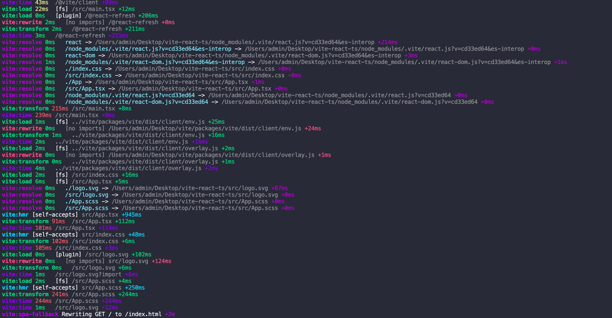

# 环境搭建

如果有兴趣自己手动debug Vite学习的同学可以通过这一章去搭建环境


## clone 

 Vite 2以monorepo的形式管理，我们clone到本地构建并软链接

```bash
git clone https://github.com/vitejs/vite
cd vite
yarn
cd packages/vite
yarn dev
yarn link
```

## init 

Vite脚手架提供了一些[预设模版](https://cn.vitejs.dev/guide/#scaffolding-your-first-vite-project)，包括但不限于`vue`、`react`、`preact`、`svelte`等框架，我们init一个react+ts的模版

```bash
yarn create @vitejs/app my-react-app --template react-ts
cd my-react-app
yarn && yarn link vite
```

## debug

我们在demo项目的`package.json`里加一条`scripts`，以开启Vite的debug模式
```json
{
  "debug": "vite --debug --profile --force"
}
```
<br>

再运行`yarn debug`，会如下所示披露出`config`、`rewrite`、`hmr`、`time`等信息，至此我们可以愉快地学习Vite了～


